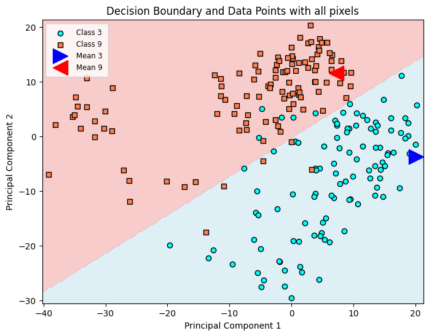
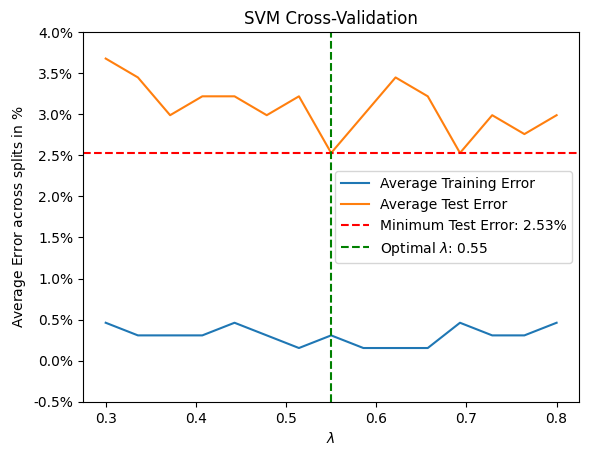
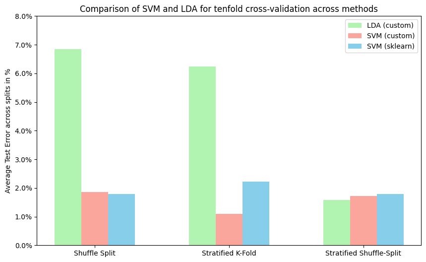

# Implementing and Benchmarking Linear Classifiers

**Machine learning coursework project** | Python · NumPy · scikit-learn · Matplotlib · optimisation · model evaluation

From-scratch implementations and comparison of linear classification methods on the scikit-learn handwritten-digits dataset. The project frames the task as a binary classification problem—distinguishing handwritten **3s** from **9s**—and evaluates how feature representations, classifier assumptions, optimisation, and validation strategy affect performance.

The work is presented in [Linear_Classifier.ipynb](Linear_Classifier.ipynb).

## What I built

- A nearest-class-mean baseline in a PCA feature space.
- A binary Linear Discriminant Analysis (LDA) classifier using a pooled covariance estimate.
- A linear Support Vector Machine (SVM) trained from scratch with batch gradient descent, hinge loss, and L2 regularisation.
- A scikit-learn linear SVM baseline for an independent implementation comparison.
- Repeated ShuffleSplit, Stratified K-Fold, and Stratified ShuffleSplit evaluation workflows.
- Visualisations for PCA decision boundaries, optimisation, regularisation selection, and model comparison.

## Problem and data

The [Digits dataset](https://scikit-learn.org/stable/modules/generated/sklearn.datasets.load_digits.html) contains 8×8 grayscale images of handwritten digits. This project selects labels 3 and 9, so every image is represented by 64 pixel-intensity features and assigned one of two classes.

The notebook first uses a reproducible 60/40 train/test split (random_state=2) for exploratory figures, then uses repeated resampling strategies to compare models more robustly. Constant-valued pixels can be removed before fitting to avoid uninformative features and singular covariance directions.

## Methods

| Method | Implementation | Key assumption / objective |
| --- | --- | --- |
| Nearest class mean + PCA | NumPy | Assign each point to the nearest class centroid after dimensionality reduction |
| LDA | NumPy | Class-conditional Gaussians with a shared covariance matrix |
| Linear SVM | NumPy | Minimise L2-regularised hinge loss with batch gradient descent |
| Linear SVM baseline | scikit-learn SVC(kernel="linear") | Reference implementation |

### Custom SVM objective

For labels mapped to $y_i\in\{-1,+1\}$, the custom SVM minimises

$$ \mathcal{L}(\mathbf w,b) = \frac{1}{2}\lVert\mathbf w\rVert_2^2 + \frac{\lambda}{N}\sum_{i=1}^{N} \max\!\left(0,\,1-y_i(\mathbf w^\top\mathbf x_i+b)\right). $$

Features are standardised using training-set statistics before optimisation. The notebook sweeps $\lambda$ over a fixed grid and records train/test errors across repeated stratified splits.

## Results

The saved notebook results below are average held-out errors; lower is better. They should be interpreted as an instructional comparison on a small binary subset rather than as a general benchmark.

| Validation strategy | Custom LDA | Custom linear SVM | scikit-learn linear SVM |
| --- | ---: | ---: | ---: |
| 10× ShuffleSplit | 6.85% | 1.85% | 1.78% |
| 10-fold Stratified K-Fold | 6.25% | 1.10% | 2.21% |
| 10× Stratified ShuffleSplit | 1.58% | 1.71% | 1.78% |

The custom SVM achieved low error under all three protocols and was comparable to the scikit-learn baseline. The LDA result depended more strongly on the split, illustrating why validation design matters, particularly when covariance estimates are sensitive to the training subset.

*LDA decision boundary visualised in a two-dimensional PCA projection. The classifier itself is fitted in the full pixel space after removal of constant features.*

| Regularisation selection | Cross-validation comparison |
| --- | --- |
|  |  |

*A five-split stratified shuffle-split sweep selected $\lambda=0.55$ among the values evaluated, with a mean held-out error of 2.53%. The comparison figure reports the saved ten-split / ten-fold evaluation results.*

## Technical takeaways

- **Dimensionality reduction:** PCA is used to expose structure and visualise decision boundaries. This separates the purpose of visualisation from the higher-dimensional model fit.
- **Optimisation:** The SVM implementation derives and applies gradients for the differentiable subgradient form of the hinge-loss objective.
- **Evaluation:** Comparing shuffled and stratified resampling demonstrates how class-preserving splits and data-partition choices affect measured performance.
- **Baseline discipline:** The from-scratch SVM is compared with a well-tested library implementation rather than reported in isolation.

## Run locally

    python -m venv .venv
    source .venv/bin/activate
    pip install jupyter matplotlib numpy scikit-learn
    jupyter notebook Linear_Classifier.ipynb

Run the notebook from top to bottom. It downloads no external data; load_digits() is distributed with scikit-learn.

## Repository structure

    .
    ├── Linear_Classifier.ipynb  # Implementations, evaluation, and visualisations
    ├── assets/                  # Curated plots exported from notebook results
    └── README.md

## Limitations and next steps

This is an educational binary-classification project, not a production classifier. A stronger next iteration would use nested cross-validation for hyperparameter selection, set an explicit random seed for SVM weight initialisation, report uncertainty across folds, and extend the comparison to multiclass digits and non-linear kernels.
